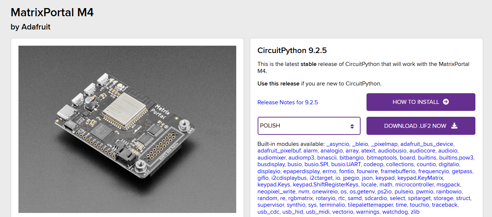
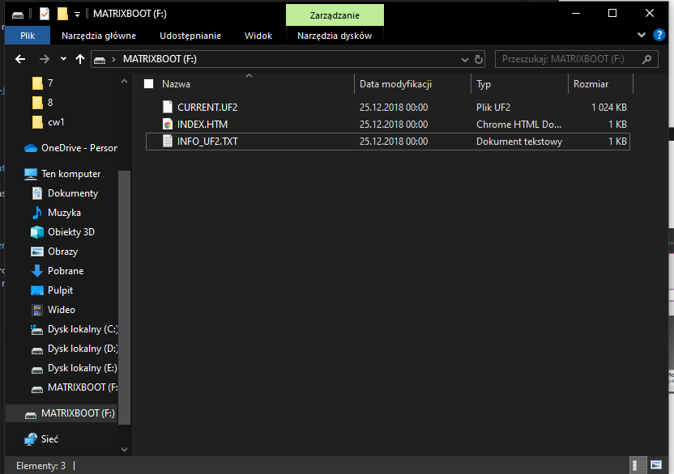
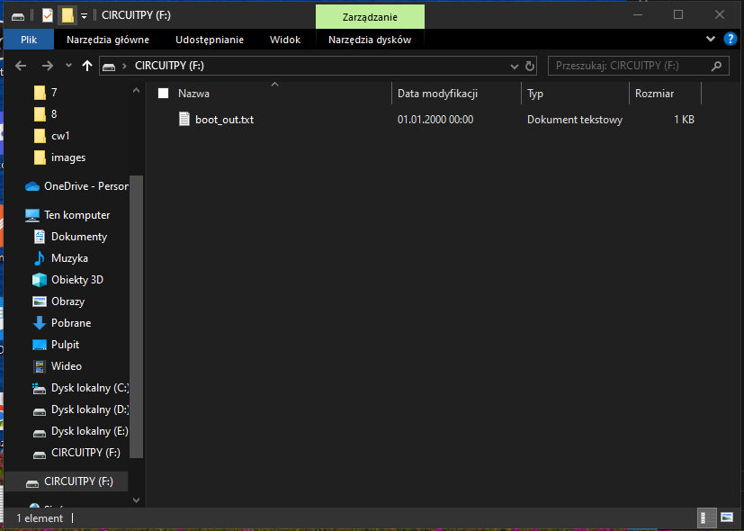
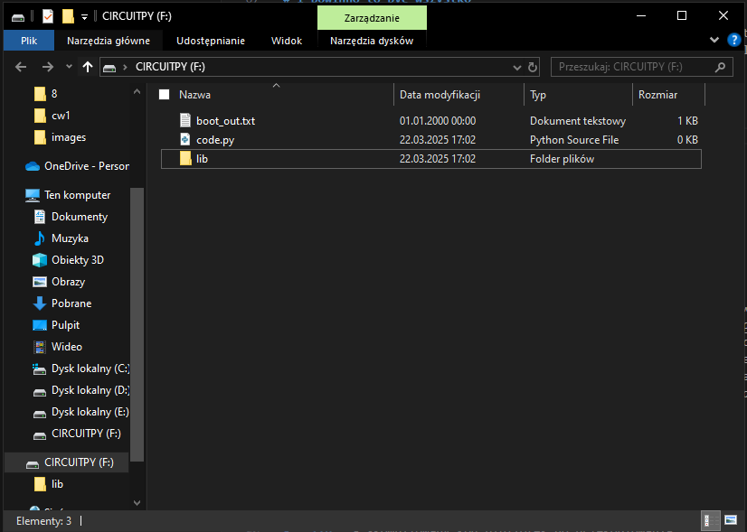
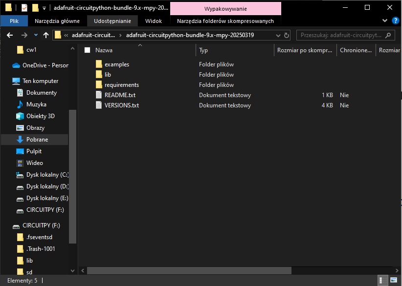

# Czym jest CircuitPython?

Jest to [fork](https://pl.wikipedia.org/wiki/Fork) [MicroPythona](https://micropython.org/). Składa się z kompilatora Pythona do bytecodu i interpretera, dzięki któremu możemy uruchamiać programy napisane w Pythonie na mikrokontrolerach. Dodatkowo udostępnia też [CoreModules](https://docs.circuitpython.org/en/latest/shared-bindings/index.html). W nich znajdziemy moduły przydatne do komunikacji z naszą płytką. Nie każdy moduł jest dostępny na każdym mikrokontrolerze, możemy sprawdzić to w [tej tabelce](https://docs.circuitpython.org/en/latest/shared-bindings/support_matrix.html). Może to wynikach z braku odpowiednich zasobów sprzętowych, czy z tego że jeszcze komuś nie chciało się tego zrobić 😉

---

# Czy mogę w nim pisać Pythona jak na komputerze?

Składnia jest taka sama. Ale CircuitPython (jak na razie, mają w planach 😜) implementuje tylko pewien podzbiór biblioteki standardowej Pythona (CPython). [Tutaj lista.](https://docs.circuitpython.org/en/latest/docs/library/index.html#)

---

# Dobra, ale jak go zainstalować?

---

# Czy wspiera naszą płytkę?

Na tej [stronie](https://circuitpython.org/downloads) możemy sprawdzić czy nasza płytka jest wspierana przez CircuitPythona.

---

# Pobieramy!

Gdy już znajdziemy nasz mikrokontroler, to musimy pobrać odpowiednią wersje i zainstalować na naszym sprzęcie.

---

# Przykład dla Matrix Portal M4

---

# Podepnij do komputera

Upewnij się, czy masz dobry kabel 😆. Musi on przesyłać dane nie tylko zasilać.

---

# Uruchom Bootloader

By zainstalowac CircuitPython na naszym sprzęcie, musimy dostać się do Bootloadera. W moim przypadku trzeba kliknąc dwa razy przycisk Reset na mikrokontrolerze.

---

# Urządzenie powinno się pojawić jako dysk

---

# Przeciągnij pobrany plik

---

---

# I powinno to być wszystko

Polecam usunąć wszystko z dysku CIRCUITPY, bo mogły tam pozostać stare pliki. Po usunięciu wystarczy stworzyć plik code.py (jest to plik startowy dla naszego programu) oraz folder lib, gdzie będziemy wrzucać biblioteki.

---

---

# Mamy już CircuitPythona 🎉

---

# Gdzie pisać kod?

Po zapisaniu pliku na dysku CIRCUITPY, powoduje przeładowanie, więc możemy pisać nawet w notatniku. Ale to nie jest wygodne, nie widzimy np. wyjścia naszego programu. Moglibyśmy go zobaczyć ale musimy się połączyć np. przez Putty. Możesz poczytać o tym [tutaj](https://learn.adafruit.com/welcome-to-circuitpython/advanced-serial-console-on-windows). Ja skorzystam z *vscode* z wtyczką [CircuitPython v2](https://marketplace.visualstudio.com/items?itemName=wmerkens.vscode-circuitpython-v2). [Tutaj](https://learn.adafruit.com/welcome-to-circuitpython/recommended-editors) możemy poczytać o innych edytorach.

---

# Biblioteki

Poza CoreModules i standarodwej bilioteki, czasami możemy potrzebować coś więcej, by ułatwić, przyspieszyć sobie prace. Na [stronie](https://circuitpython.org/libraries) CircuitPython mamy paczki biliotek oficjalnie wspieranych przez Adafruit oraz wersje community. Wystarczy skopiować wybraną biliotekę z folderu /lib paczki bibliotek do folderu /lib naszego urządzenia. Czasami jakaś biblioteka korzysta z innej i musimy ją wtedy też dorzucić. Możemy się o tym dowiedzieć z folderu requirements.

---

- **examples** - przykładowe użycia bibliotek
- **lib** - skompilowany kod bibliotek do przekopiowania
- **requirements** - folder z zależnościami dla bibliotek

---

# Więcej o CircuitPythonie

- [Welcome to CircuitPython!](https://learn.adafruit.com/welcome-to-circuitpython/overview) - wprowadzenie do CircuitPythona
- [CircuitPython Essentials](https://learn.adafruit.com/circuitpython-essentials/circuitpython-essentials) - mini kurs CircuitPythona
- [Dokumentacja CircuitPythona](https://docs.circuitpython.org/en/latest/README.html)
- [Strona CircuitPythona](https://circuitpython.org/)