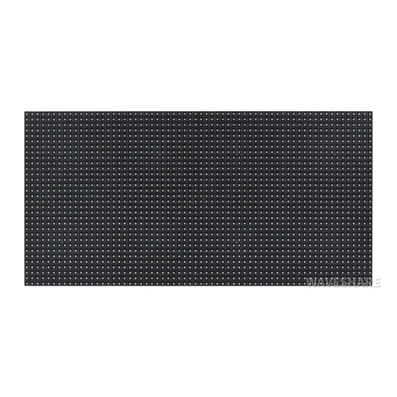
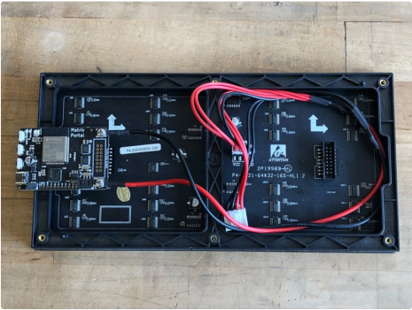
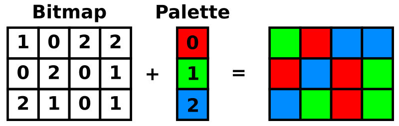
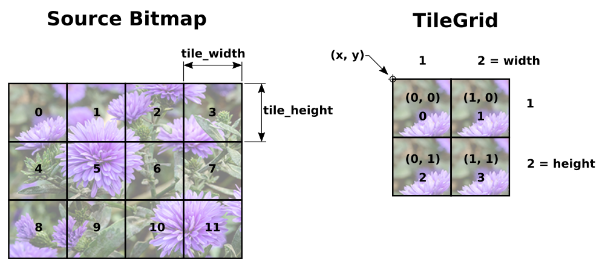
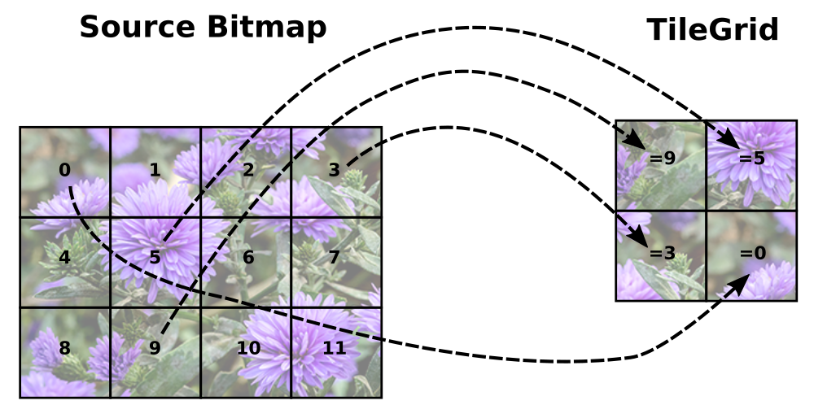
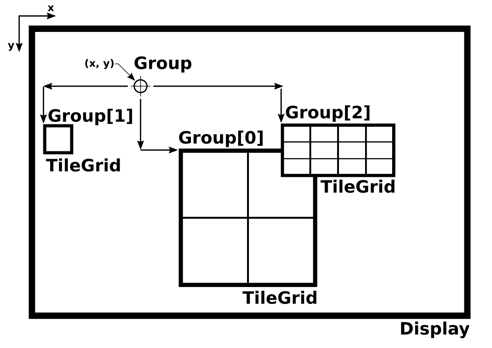
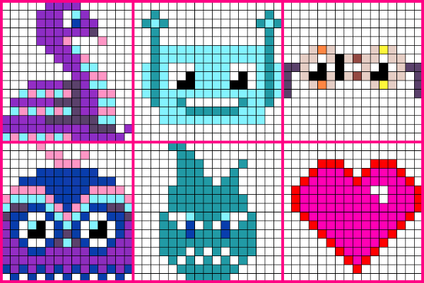

# Przykładowy sprzęt

---

# Wyświetlacz matrycowy LED RGB z HUB75

.jpg)


---

# Mikrokontroler Adafruit MatrixPortal M4



---

# Czym jest framebuffer

Framebuffer (bufor ramki) - jest to obszar pamięci, który przechowuje dane o tym, co ma być wyświetlone na ekranie lub wyświetlaczu. W przypadku macierzy RGB, framebuffer przechowuje informacje o kolorach każdej diody LED (piksela) na macierzy.

---

# Jak działa framebuffer?

1. **Przechowywanie danych**: Framebuffer to tablica w pamięci, która przechowuje wartości kolorów dla każdego piksela na wyświetlaczu.

2. **Renderowanie**: Gdy program chce coś wyświetlić na ekranie, najpierw aktualizuje framebuffer, zapisując w nim nowe dane (np. kolory pikseli). Następnie dane z framebuffera są przesyłane do wyświetlacza (np. macierzy RGB), który odtwarza je na fizycznych diodach LED.

---

# Framebuffer w kontekście macierzy RGB

W przypadku macierzy RGB, framebuffer jest używany do przechowywania informacji o stanie każdej diody LED. Oto jak to działa:

- Reprezentacja macierzy: Framebuffer to tablica 2D, gdzie każdy element odpowiada jednemu pikselowi na macierzy RGB. Na przykład, dla macierzy 32x32, framebuffer będzie miał rozmiar 32x32, a każdy element będzie przechowywał wartości kolorów (np. RGB).

---

# Moduły CircuitPython przydatne do wyświetlania

---

# rgbmatrix

Niskopoziomowy moduł do połączenia się z naszym wyświetlaczem, sterownik. Transmituje dane do matrycy, czyli zapala lampki. Dokumentacja dostępna [tutaj](https://docs.circuitpython.org/en/latest/shared-bindings/rgbmatrix/).

---

# displayio

Wysokopoziomowy moduł. Pozwala nam definiować co chcemy wyświetlać. Dokumentacja dostępna [tutaj](https://docs.circuitpython.org/en/latest/shared-bindings/displayio/).

---

# framebufferio

Moduł jest pośrednikiem między displayio, a rgbmatrix. Zarządza framebufferem wyświetlacza, synchronizuje kiedy i co ma się pokazywać. Dokumentacja dostępna [tutaj](https://docs.circuitpython.org/en/latest/shared-bindings/framebufferio/index.html).

---

# Prosty przykład

examples/REPLprint

---

# Więcej o displayio

---

# [Palette](https://docs.circuitpython.org/en/latest/shared-bindings/displayio/#displayio.Palette) - tablica kolorów

```py
palette = displayio.Palette(3)

palette[0] = 0xFF0000 # red
palette[1] = 0x00FF00 # green
palette[2] = 0x0000FF # blue
```

---

# [Bitmap](https://docs.circuitpython.org/en/latest/shared-bindings/displayio/#displayio.Bitmap) - tablica 2d wartości z Pallete

```py
#displayio.Bitmap(width: int, height: int, value_count: int)
bitmap = displayio.Bitmap(320, 240, 3)

#set all pixels with 1
bitmap.fill(1)

# set the pixel at (x, y) = (23, 42) to a value of 2
bitmap[23, 42] = 2

```

---

# Bitmap + Pallete



---

# [TileGrid](https://docs.circuitpython.org/en/latest/shared-bindings/displayio/#displayio.TileGrid) - siatka kafelków z bitmapy, łaczy wartości bitmapy z kolorami z Pallete



---



---

# Jest to jak nieskończona wycinanka. Tniemy bitmape i układamy TileGrid.

---

# [Group](https://docs.circuitpython.org/en/latest/shared-bindings/displayio/#displayio.Group) - grupuje, łączy inne elementy, podobie jak znacznik div. Potrzebna nam jest do wyświetlenia.

---



---

# Przykład

examples/SpriteSheet inspiracja z tej [strony](https://learn.adafruit.com/circuitpython-display-support-using-displayio/sprite-sheet)



---

# Przydatne biblioteki

- [**adafruit_imageload**](https://docs.circuitpython.org/projects/imageload/en/latest/) - ładuje bitmape, pallete z pliku
- [**adafruit_display_text**](https://docs.circuitpython.org/projects/display_text/en/latest/) - pomaga wyświetlić tekst
- [**adafruit_display_shapes**](https://docs.circuitpython.org/projects/display-shapes/en/latest/) - pomaga wyświetlać figury

---

# Co jeśli to dla mnie za mało?

- [displayio kurs](https://learn.adafruit.com/circuitpython-display-support-using-displayio/introduction)
- [displayio docs](https://docs.circuitpython.org/en/latest/shared-bindings/displayio/#displayio.Group)
- [rgbmatrix docs](https://docs.circuitpython.org/en/latest/shared-bindings/rgbmatrix/)
- [framebufferio docs](https://docs.circuitpython.org/en/latest/shared-bindings/framebufferio/index.html)